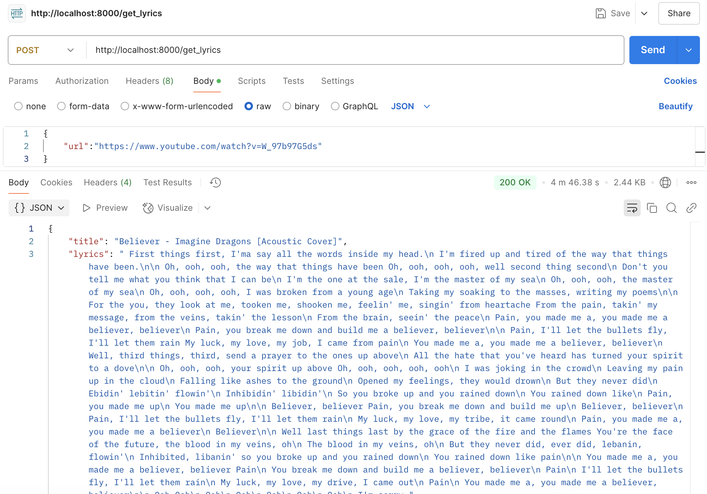
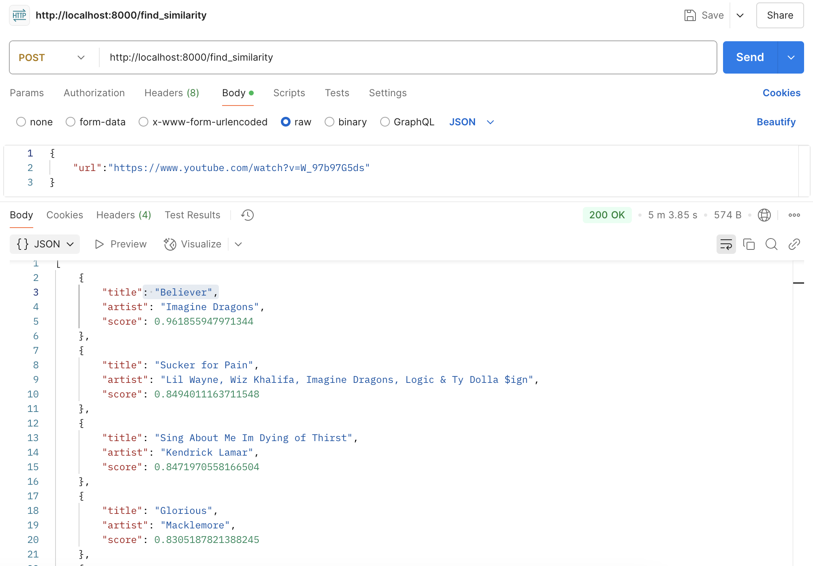

# Song Finder

This project aims to identify the **exact** or **most similar** song based on the lyrics transcribed from a given YouTube URL. It leverages multiple technologies for audio downloading, transcription, vector embedding, and similarity search.

---

## Table of Contents

1. [Overview](#overview)
2. [Technologies Used](#technologies-used)
3. [Installation](#setup-and-installation)
4. [How it Works](#how-it-works)
5. [Dataset](#dataset)

---

## Overview

1. **Input**: A YouTube URL.
2. **Process**:
   - Extract video title and audio using `yt-dlp`.
   - Transcribe the extracted audio using [OpenAI Whisper](https://github.com/openai/whisper).
   - Split the resulting lyrics (if too long) and convert to embeddings using a Sentence Transformer model (`all-mpnet-base-v2`).
   - Aggregate or directly use these embeddings to find the most similar or exact match from a pre-built FAISS vector database of 1,000 popular songs.
3. **Output**: The project returns the song (or songs), the artist (or artists) and the similarity score (or scores) from the database that best matches the transcription.

---

## Technologies Used

- **[yt-dlp](https://github.com/yt-dlp/yt-dlp)**: A feature-rich command-line audio/video downloader.
- **[OpenAI Whisper](https://github.com/openai/whisper)**: A state-of-the-art speech recognition model.
- **[FAISS](https://github.com/facebookresearch/faiss)**: A library for efficient similarity search and clustering of dense vectors.
- **[LangChain](https://github.com/hwchase17/langchain)**: A framework that simplifies building applications with large language models.
- **[Sentence Transformers](https://github.com/UKPLab/sentence-transformers)**: For embedding the lyrics; uses `all-mpnet-base-v2` in this project.
- **[FastAPI](https://fastapi.tiangolo.com/)**: A modern, fast (high-performance) web framework for building APIs in Python.

---

## Installation

- pip install -r requirements.txt
- cd src
- python create_vdb.py # To create a vectordatabase
- uvicorn main:app --reload # To run the FastAPI server

## How It Works

1. **Audio Extraction (yt-dlp)**
- Using yt-dlp to download only the audio portion of the YouTube URL and save it in a format compatible with Whisper.

2. **Transcription (OpenAI Whisper)**
- Whisper transcribes the audio, producing text that represents the lyrics or speech content.

3. **Sentence Embeddings (Sentence Transformers)**
- Using the all-mpnet-base-v2 model.
- If the transcription exceeds the model's sequence length, we split it into chunks.
- Each chunk is converted into an embedding vector, and then these vectors are averaged to form a single representative embedding.

4. **Similarity Search (FAISS)**
- A FAISS vector database was pre-built using the top 1,000 viewed song lyrics from the Kaggle dataset.
- Comparing the new embedding to all vectors in the database using cosine similarity.
- The result is the most similar (or exact) match for the input audio’s lyrics.

5. **API Response**
- The system returns the song title, artist name and the similarity score (and potentially artist or other metadata) that is closest in meaning to the transcribed lyrics.

## Dataset

- The dataset is sourced from **[Genius Song Lyrics (Kaggle)](https://www.kaggle.com/datasets/carlosgdcj/genius-song-lyrics-with-language-information)**.
- Only the top 1,000 viewed songs were used in constructing the FAISS vector database to keep the scope manageable.

> **Note**: This project was created as an inspiration from a technical assessment process, showcasing end-to-end integration of various AI and web technologies.

